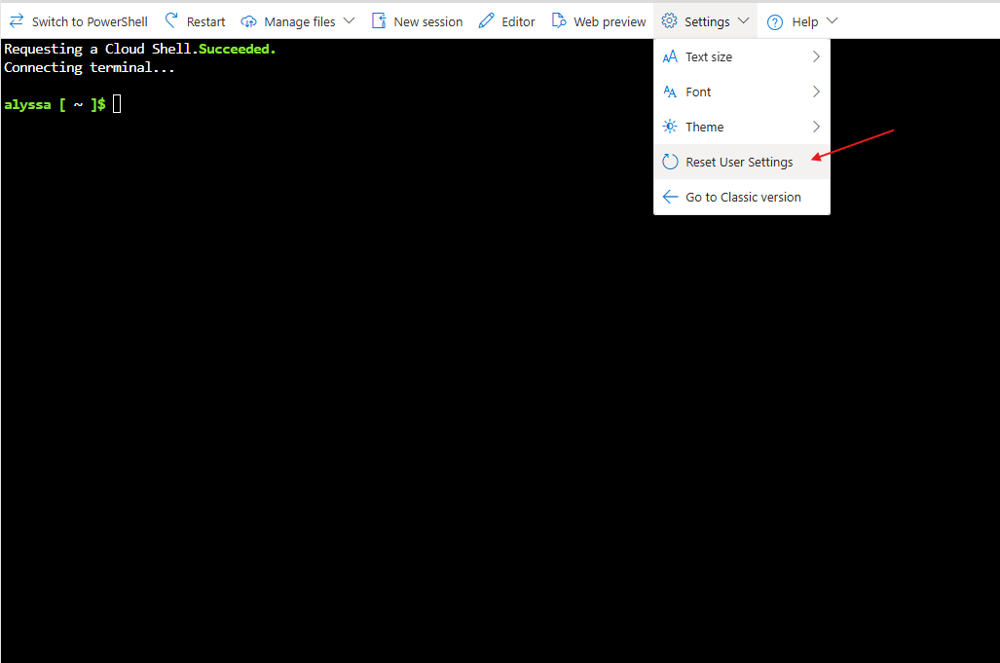
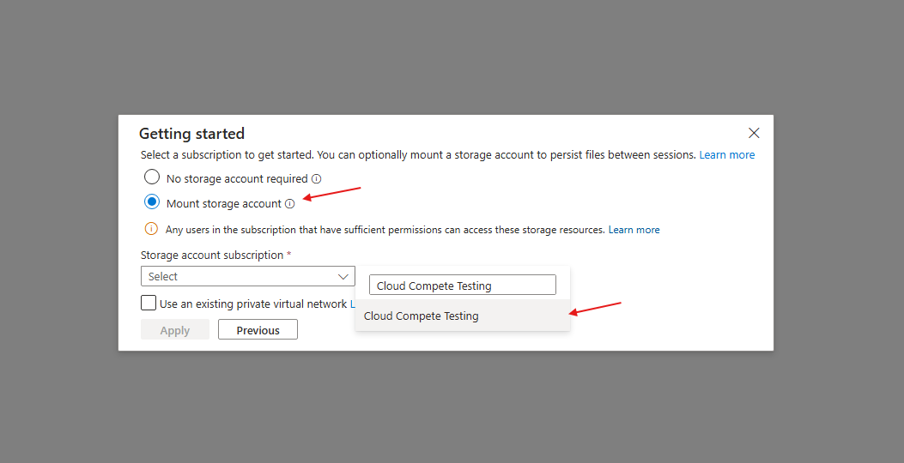
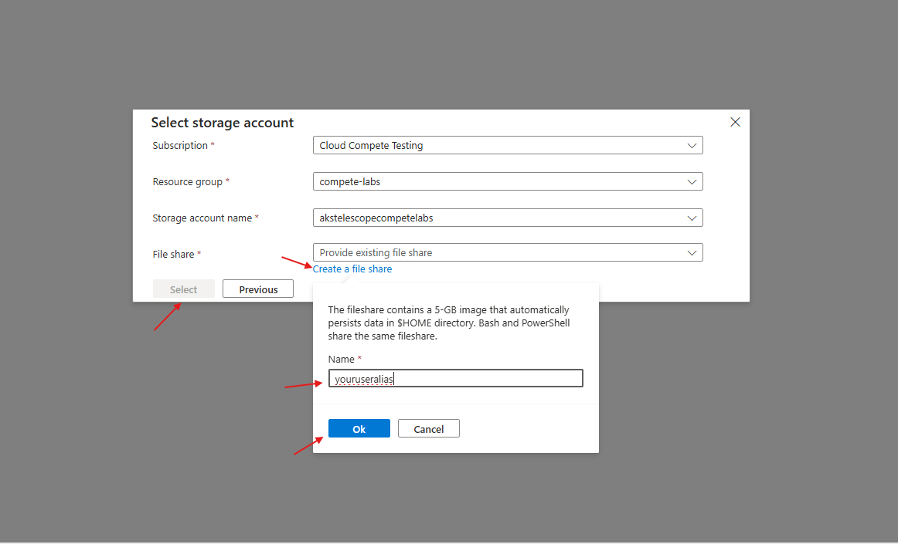

# Persist Cloud Shell data to avoid accidental closure

## Reset User Settings

* If this is your first time using Cloud Shell, skip to [here](#set-up-storage-account)
* If you already set up Cloud Shell without Storage Account, reset your user settings by choosing **Settings** in the top panel. Next, choose **Reset User Settings**

* Click **Reset** to confirm

## Set Up Storage Account

* Choose **Bash** as shell mode

* Next, choose **Mount storage account** and search for **Cloud Compete Testing** under *Storage account subscription*

* Then choose **Select existing storage account** and click **Next**

* Fill in the *Resource group* with **compete-labs** and *Storage account name* with **akstelescopecompetelabs**
* In *File share* section, choose **Create a file share** and type your name or useralias under *Name* and click *Ok*
* Once all information is filled in, click **Select** and wait for CloudShell session to be open

* Once CloudShell is ready, you can run `ls` command and look for `clouddrive` folder to confirm that storage account is successfully mounted

